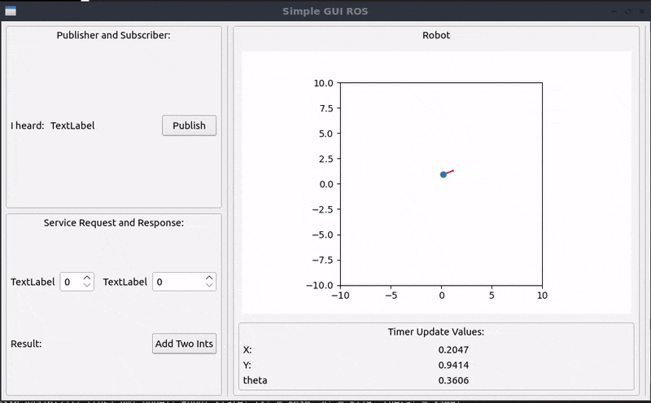

# simple_gui

A simple demo application using PyQt5 for creating HMIs in ROS2.

The code has been tested to function with ROS 2 Humble Hawksbill.

---

## Usage Instruction

1. Clone this repository in the root of your ROS2 workspace: `git clone https://github.com/sampreets3/simple_gui`
1. Install the necessary dependencies of the package: `pip3 install pyqt5`
1. Build the package at the root of your workspace: `colcon build --packages-select simple_gui`
1. Source the setup file from the root of your workspace: `source install/setup.bash`
1. Open a terminal and start the HMI using : `ros2 run simple_gui ros2_hmi_node`

This should open up a small HMI as shown below:

<p align="center">
    
</p>

## Usage Instruction (if using Docker)

1. Clone this repository in the root of your ROS 2 workspace: `git clone https://github.com/sampreets3/simple_gui.git`
1. Navigate to the root of the `simple_gui` package:   `cd <ros2_ws>/src/simple_gui`
1. Build the image from the Dockerfile provided :   `docker build -t image_simple_gui ./docker/`
1. Run the container using the script provided :  `chmod +x ./docker/run_ros2_container.sh && ./docker/run_ros2_container.sh`
1. Build the workspace inside the container : `colcon build && . install/setup.bash`
1. Launch the application : `ros2 launch simple_gui simple_gui.launch.py`

This would open up the same HMI as mentioned before.

---

## Modify the Application

You need to install the application Qt Designer on your computer in order to edit the `simple_gui/simple.ui` file. If you have the application installed, and you click on the ui file, it should take you directly to the Qt Designer window. 

Once you have finished making your modifications, you can save the ui _(Ctrl+S)_, and come back to the `simple_gui` module. You can generate the `simple_gui.py` file from this ui file by using the `pyuic5` tool :

```sh
pyuic5 -x simple.ui -o simple_gui.py
# Note that we are in the simple_gui/simple_gui directory while doing this operation
```

From there on, you can continue to edit the `gui_ros_node` file, in order to define the event callbacks and other modifications you might want to make. It is advised to always name the elements you create _(PushButtons, TextLabels, etc.)_, so that you can very easily refer to them as inside the `MyGuiNode` class as `self.ui.<name-of-push-button>, self.ui.<name-of-textlabel>`, and so on.

The rest of the package should not need to be changed, unless you want to add some helper files inside the module. Then you should add them into the `setup.py` file in the `py_modules` section.

---

## Features

- Publish data to a pre-defined topic at the press of a button.
- Subscribe to incoming data from a topic and display as a textLabel.
- Periodically update the state of the robot using a ROS timer.
- Accept an input from a spinbox, to call a ROS service.
- Update textLabel with the response of the service.
- Display the pose of the robot on a map.
---